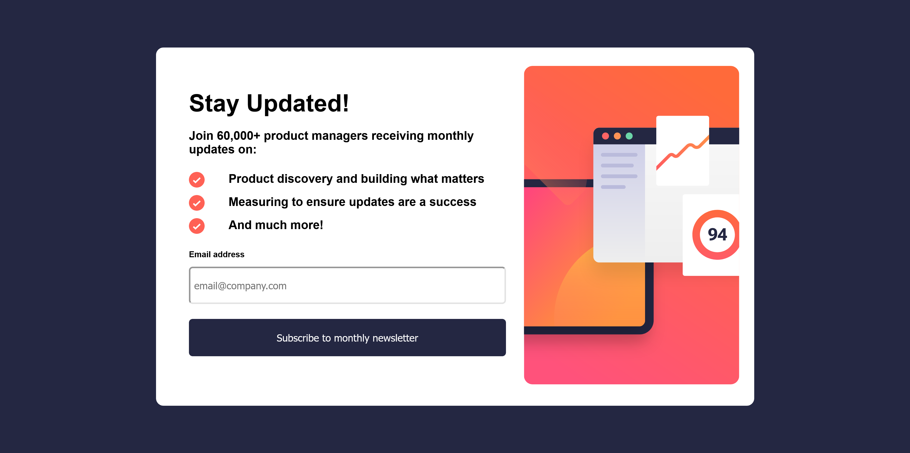

# Frontend Mentor - Newsletter sign-up form with success message solution

This is a solution to the [Newsletter sign-up form with success message challenge on Frontend Mentor](https://www.frontendmentor.io/challenges/newsletter-signup-form-with-success-message-3FC1AZbNrv). Frontend Mentor challenges help you improve your coding skills by building realistic projects. 

## Table of contents

- [Overview](#overview)
  - [The challenge](#the-challenge)
  - [Screenshot](#screenshot)
  - [Links](#links)
- [My process](#my-process)
  - [Built with](#built-with)
  - [What I learned](#what-i-learned)
  - [Continued development](#continued-development)
  - [Useful resources](#useful-resources)
- [Author](#author)
- [Acknowledgments](#acknowledgments)

## Overview

### The challenge

Users should be able to:

- Add their email and submit the form
- See a success message with their email after successfully submitting the form
- See form validation messages if:
  - The field is left empty
  - The email address is not formatted correctly
- View the optimal layout for the interface depending on their device's screen size
- See hover and focus states for all interactive elements on the page

### Screenshot

### Links

- Live Site URL: (https://zhangxilong-edward.github.io/newsletter-sign-up-with-success-message-main/index.html)

## My process

### Built with

- Semantic HTML5 markup
- CSS custom properties
- Flexbox
- CSS Grid
- Mobile-first workflow
- Vanilla JavaScript 

### What I learned

1. <button type="button"> and <button type="submit"> should listen to different event listeners. 
- for type button - we can use a click event 
- for type submit - we should use submit event
- one thing to note is that: 
- make sure the click EventListener is attached to the element where the user is expected to click, 
- but the submit EventListener should be attached to the form element that the user is submitting.

2. insert elements after and before: 
- after: 
- [emailLabel].parentNode.insertBefore([errortext], [emailLabel].nextSibling);
- before: 
- parentNode.insertBefore([newNode], [referenceNode]);
- or use 
- [referenceNode].insertAdjacentElement('beforebegin', [newNode]);

3. there is CSS specificity order, when a css style is not working, be sure to check 

4. HTML form has built-in validation, if you use submit event listener, the built-in validation would kick in first!

5. disbale scroll on body: 

body {
   height: 100%;
   overflow-y: hidden;
}

### Continued development

Use this section to outline areas that you want to continue focusing on in future projects. These could be concepts you're still not completely comfortable with or techniques you found useful that you want to refine and perfect.

**Note: Delete this note and the content within this section and replace with your own plans for continued development.**

### Useful resources

- [ovrelay in CSS](https://www.cssscript.com/minimal-overlay-modal-pure-css/) 
- [DOM nextSibling](https://www.w3schools.com/jsref/prop_node_nextsibling.asp#:~:text=nextSibling%20vs%20nextElementSibling,not%20text%20and%20comment%20nodes) - This is an amazing article which helped me finally understand DOM nextSibling. I'd recommend it to anyone still learning this concept.
- [button type difference - submit and button](https://stackoverflow.com/questions/290215/difference-between-input-type-button-and-input-type-submit) and (https://betterprogramming.pub/click-vs-submit-eventlisteners-536b62be9359)

